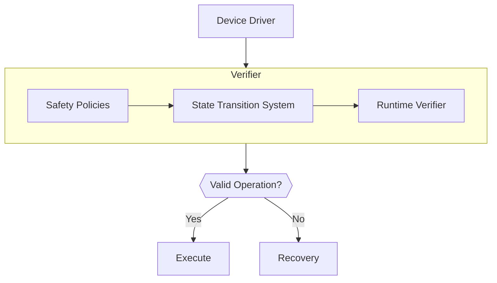

# Runtime verifier for device driver models

## Concept

RV-DDM (Runtime Verifier for Device Driver Models) is an advanced tool designed to ensure the proper execution of operations in device drivers. It functions by validating a sequence of commands against predefined safety policies that represent the accurate device model. Incorrect sequences, parameters, or timings in these commands often lead to failed operations on the device, and RV-DDM acts as a preventative mechanism at the lowest layer of the device driver to prevent such failures.

RV-DDM leverages extended BNF (Backus-Naur Form) formulas to define safety policies. These BNF formulas encapsulate the rules governing the device driver operation sequences and are subsequently compiled into a state transition system with inherent temporal awareness. This state transition system acts as a runtime monitor, meticulously analyzing incoming command sequences and filtering out any commands that violate the defined safety policies.

Through this process, RV-DDM offers a robust and proactive approach to ensure the smooth and safe functioning of device drivers. Its meticulous verification process not only maintains operational efficiency but also fortifies the safety of the overall system by preemptively identifying and eliminating potential threats or errors in the execution sequence.

